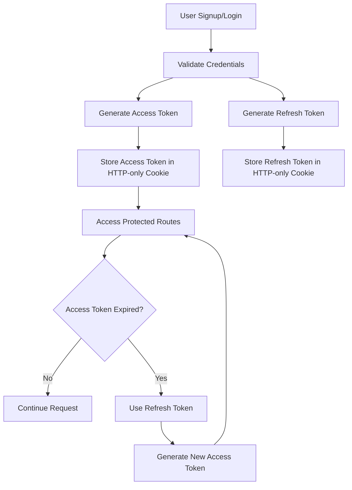

# 🚀 Secure Authentication & Authorization System with NestJS

<div align="center">


### 🔐 Production-Ready Authentication & Authorization Backend

A secure and scalable backend authentication system built with **NestJS**, implementing industry-standard security practices including **JWT Authentication**, **Refresh Tokens**, **HTTP-only Cookies**, and **Role-Based Authorization**.

</div>

---

# 📌 Overview

This project demonstrates how modern authentication systems are built in real-world applications using clean architecture principles and secure backend practices.

The system includes:

* 🔑 JWT Authentication
* 🔄 Access & Refresh Token Flow
* 🍪 HTTP-only Cookie Security
* 🛡️ Route Protection with Custom Guards
* 🔐 Password Hashing with bcrypt
* 🗄️ PostgreSQL + TypeORM Integration
* 👤 User CRUD Operations
* ⚡ Scalable NestJS Architecture

---

# ✨ Features

## 🔐 Authentication System

* User Signup & Login
* JWT Access Token Authentication
* Refresh Token Mechanism
* Secure Logout System
* Password Encryption using bcrypt

## 🛡️ Authorization & Security

* Protected Routes with Custom AuthGuard
* HTTP-only Cookies for Token Storage
* Role & Ownership Based Authorization
* Token Expiration Handling
* Validation & Exception Handling

## 🗄️ Database & Backend

* PostgreSQL Database Integration
* TypeORM ORM Support
* Clean Modular Folder Structure
* DTO Validation using class-validator
* Environment Variable Configuration

---

# 🏗️ Tech Stack

| Technology | Purpose             |
| ---------- | ------------------- |
| NestJS     | Backend Framework   |
| TypeScript | Type Safety         |
| PostgreSQL | Relational Database |
| TypeORM    | ORM                 |
| JWT        | Authentication      |
| bcrypt     | Password Hashing    |
| Express    | HTTP Server         |

---

# 🔄 Authentication Flow



---

# 📂 Project Structure

```bash
src/
│
├── auth/
│   ├── guards/
│   ├── dto/
│   ├── strategies/
│   ├── auth.controller.ts
│   ├── auth.service.ts
│   └── auth.module.ts
│
├── users/
│   ├── dto/
│   ├── entities/
│   ├── users.controller.ts
│   ├── users.service.ts
│   └── users.module.ts
│
├── common/
│   ├── guards/
│   ├── decorators/
│   └── filters/
│
├── database/
│
├── app.module.ts
└── main.ts
```

---

# 🔑 Core Security Features

## ✅ JWT Authentication

* Short-lived Access Tokens (15 minutes)
* Long-lived Refresh Tokens (7 days)

## 🍪 HTTP-only Cookies

Tokens are securely stored in HTTP-only cookies to help protect against:

* XSS Attacks
* Client-side token exposure
* Token theft via JavaScript

## 🔐 Password Hashing

Passwords are hashed using bcrypt before being stored in the database.

---

# 🛠️ Installation & Setup

## 1️⃣ Clone the Repository

```bash
git clone <your-repository-url>
cd <project-folder>
```

## 2️⃣ Install Dependencies

```bash
npm install
```

## 3️⃣ Configure Environment Variables

Create a `.env` file:

```env
PORT=3000

DATABASE_HOST=localhost
DATABASE_PORT=5432
DATABASE_USER=postgres
DATABASE_PASSWORD=your_password
DATABASE_NAME=auth_system

JWT_SECRET=your_jwt_secret
JWT_REFRESH_SECRET=your_refresh_secret
```

## 4️⃣ Run the Project

```bash
npm run start:dev
```

---

# 📡 API Endpoints

| Method | Endpoint        | Description          |
| ------ | --------------- | -------------------- |
| POST   | `/auth/signup`  | Register User        |
| POST   | `/auth/login`   | Login User           |
| POST   | `/auth/refresh` | Refresh Access Token |
| POST   | `/auth/logout`  | Logout User          |
| GET    | `/users`        | Get All Users        |
| GET    | `/users/:id`    | Get User By ID       |
| PATCH  | `/users/:id`    | Update User          |
| DELETE | `/users/:id`    | Delete User          |

---

# 🧠 What I Learned

This project helped me gain hands-on experience with:

* Building secure authentication systems
* Creating custom NestJS Guards
* Implementing refresh token workflows
* Secure cookie-based authentication
* Structuring scalable backend applications
* PostgreSQL + TypeORM best practices
* Validation and error handling patterns

---

# 🚀 Production-Ready Concepts Implemented

✅ Secure JWT Handling
✅ Cookie-based Authentication
✅ Token Rotation Logic
✅ Modular Architecture
✅ Route Protection
✅ Scalable Folder Structure
✅ Environment-based Configuration
✅ Clean Code Principles

---

# 📸 Future Improvements

* 🔐 Role-Based Access Control (RBAC)
* 📧 Email Verification
* 🔄 Refresh Token Rotation
* 🧪 Unit & E2E Testing
* 📊 API Documentation with Swagger
* 🐳 Docker Support
* ☁️ Deployment with CI/CD

---

# 🤝 Contributing

Contributions, issues, and feature requests are welcome.

Feel free to fork the project and submit a pull request.

---

# ⭐ Support

If you found this project useful:

* ⭐ Star this repository
* 🍴 Fork the project
* 📢 Share it with others

---

# 👨‍💻 Author

### Your Name

Backend Developer • NestJS Enthusiast • Security-Focused Developer

GitHub: `https://github.com/your-username`

---

<div align="center">

### 🔥 Building Secure & Scalable Backend Systems

Made with ❤️ using NestJS & TypeScript

</div>
